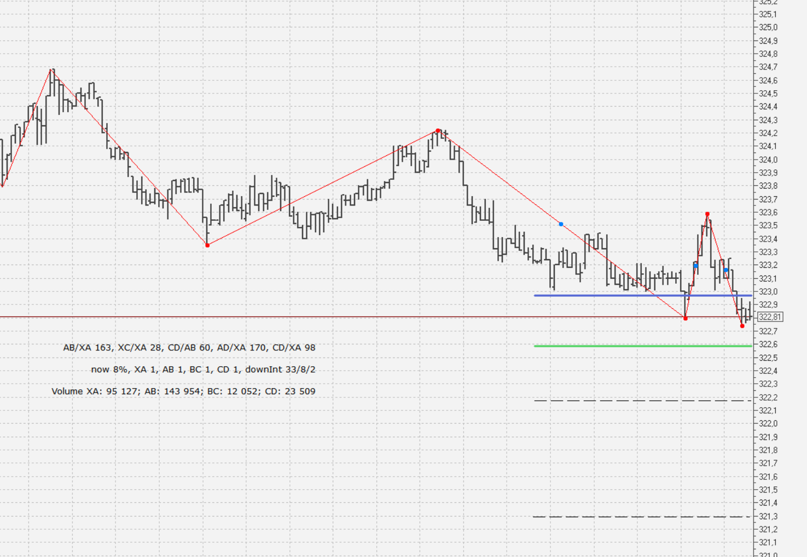
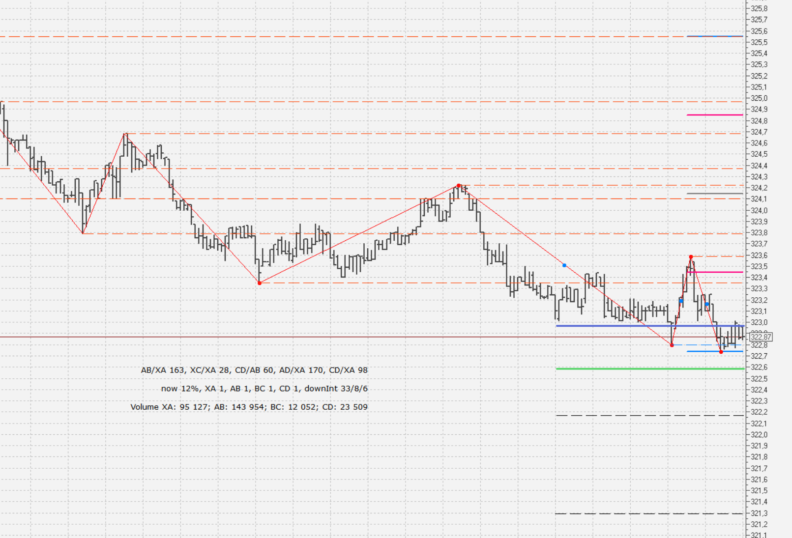

Индикатор Зиг-Заг, построенный по классическому алгоритму (версия 2) и по алгоритму отклонения больше порога от прошлой волны.

Индикатор также позволяет видеть уровни вершин, выводит точки середины волны, также есть некий алгоритм предсказания движения
(вывод целевых зон). Также есть вывод метки с статистикой по последним 5-и волнам, точкам формации XABCD.

##Основные настройки

	showCalculatedLevels = 0, -- показывать уровни от прошлого движения
	showextraCalculatedLevels = 0, -- показывать расширения уровней от прошлого движения
	regimeOfCalculatedLevels = 2, -- 1- последнее движение, 2 - последний максимальный диапазон
	deepZZForCalculatedLevels = 10, -- глубина поиска последнего максимального диапазона по вершинам. До 20.
	showZZLevels = 0, -- показывать уровни от вершин
	numberOfZZLevels = 10, -- сколько показывать уровней от вершин до 20
	numberOfHistoryZZLevels = 0, -- сколько показывать уровней от вершин для истоических данных
	showCoG = 1, -- показывать центр движения для вил Эндрюса
	numberOfShownCOG = 3, --  глубина показа COG
	showTargetZone = 1, -- показывать целевую зону
	numberOfMovesForTargetZone = 5, --  глубина поиска движений для предсказания
	spreadOfTargetZone = 10, -- диапазон целевой зоны (%)
	showLabel = 1, -- показывать метку паттерна
	showFiboExt = 1, -- показывать расширение фибо волны
	LabelShift = 100, -- сдвиг метки от вершины

Чтобы выводилась метка по паттернам надо задать идентификтор графика.

Целевая зона строится по двум прицпам. Если удалось определить паттерн движения по этим соотношениям
(алгоритм взял из индикатора MT5).

	-- Алгоритм: проверка размера волн и корректировка по следующим от- |
	-- ношениям "Идеальных пропорций" ("Золотое сечение" версия 1):     |
	-- (в терминах XABCD точки равны: A = X, B = A, C = B, D = B, E = D)|
	--   №    (D-E)/(D-C)   "ЗС версия1" №  (E-D)/(C-D)   "ЗС версия1"  |
	--   M1    2             1.618       W1  0.3334        0.3819       |
	--   M2    0.5           0.5         W2  0.6667        0.618        |
	--   M3    1.5           1.2720      W3  1.5           1.2720       |
	--   M4    0.6667	     0.618       W4  0.5           0.5          |
	--   M5    1.3334        1.2720      W5  2             1.618        |
	--   M6    0.75          0.618       W6  0.25          0.25         |
	--   M7    3             3.0000      W7  0.5           0.5          |
	--   M8    0.3334        0.3819      W8  2             1.618        |
	--   M9    2             1.618       W9  0.3334        0.3819       |
	--   M10   0.5           0.5         W10 3             3.0000       |
	--   M11   0.25          0.25        W11 0.75          0.618        |
	--   M12   2             1.618       W12 1.3334        1.2720       |
	--   M13   0.5           0.5         W13 0.6667        0.618        |
	--   M14   1.5           1.2720      W14 1.5           1.2720       |
	--   M15   0.6667        0.618       W15 0.5           0.5          |
	--   M16   0.3334        0.3819      W16 2             1.618        |

Если паттерн не определен, то целевая зона определяется через усреднение (numberOfMovesForTargetZone = 5) прошлых движений.

##Версия 3 индикатора zz_algo

Она совмещает классический алгоритм построения и фильтры ложных движений.

Определены параметры построения offset_type, depth, calc_kind, offset_value

    --Для установки значения, необходимо поставить * перед выбранным вариантом.
    --[[Вид отсупа от вершины для определения нового тренда
    %     - в процентах
    Steps - в шагах цены
    ]]
    offset_type     = '*%; Steps',

    --Для установки значения, необходимо поставить * перед выбранным вариантом.
    --[[Вид расчета отклонения от вершины
    Extr  - от прошлой вершины. Если цена прошла от вершины размер отсупа, то это смена тренда.
    Range - в % от прошлой волны. В этом режиме параметр offset_type должен быть равен %. Если цена прошла указанный процент от прошлой волны, то это смена тренда.
    ATR   - для смены тренда цена должна пройти ATR*offset_value
    ]]
    calc_kind       = 'Extr; *Range; ATR', -- Тип расчета ZZ: Extr; Range; ATR

    offset_value    = 0.2, -- Размер отступа от вершины для начала нового тренда. Выражен в зависимости от выбранного вида расчета и типа отступа.

    depth           = 24, --Глубина поиска новой вершины. Если за указанное число баров появился новый экстремум, то он берется в анализ

Параметр calc_kind определяет вариант алгоритма расчета.
	
- Extr  - от прошлой вершины. Если цена прошла от вершины размер отсупа, то это смена тренда.
- Range - в % от прошлой волны. В этом режиме параметр offset_type должен быть равен %. Если цена прошла указанный процент от прошлой волны, то это смена тренда.
- ATR   - для смены тренда цена должна пройти ATR*offset_value

Параметр offset_type определяет тип отсупа от очередной вершины.
- %     - в процентах
- Steps - в шагах цены

При этом для режима ATR, параметр offset_type не анализируется.

Параметр depth определяет глубину поиска новой вершины. Для режима ATR он определяет период построения ATR.

Параметр offset_value определяет размер отступа от вершины для начала нового тренда. Для режима ATR он определяет сколько ATR необходимо пройти от вершины для начала нового тренда.